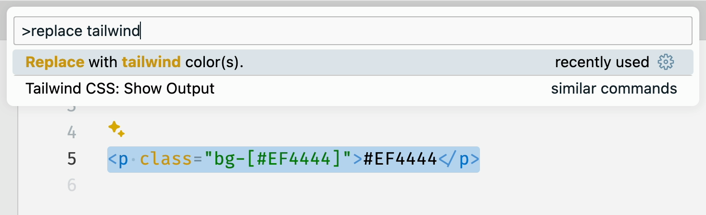
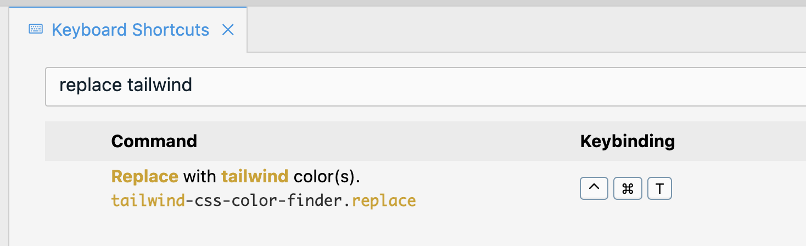

# Tailwind CSS Color Finder

A VS Code extension to find the closest tailwind color for a hex value in your code.

## Usage

Simply select some text and run the command.

Any hex color values (`#EF4444`) will be replaced with tailwind colors (`red-500`).

### Before



<!-- ```html
<p class="bg-[#EF4444]">#EF4444</p>
``` -->

### After


<!-- ```html
<p class="bg-red-500">red-500</p>
``` -->

## Suggestion

Assign a keyboard shortcut for the command.


